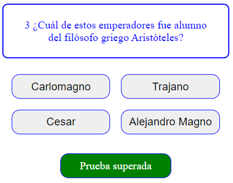

# Examen Parcial

## Desarrollo del proyecto

- Cada componente debe Finalizar con la primera letra del primer nombre y la primera letra del primer apellido (AppGV)
- Se deberá crear minimo los siguientes componentes
  - **AppXY**
  - **QuestionXY**
  - **ButtonXY (+0.3)**
- La forma para avanzar entre preguntas
  - **UseEffect (+0.3)**
  - **Otra forma (-0,3)**
- Utlizar estilos al menos en los botones **(+0.3)**
- Utilizar UseState

Importante saber:

- NO se pueden utilizar otras librerías ni temas que no se han visto, se recomienda proporcionar una solución básica ajustada a lo solicitado, ya que el objetivo principal es evaluar sus habilidades con React y Javascript.

> Happy coding!

